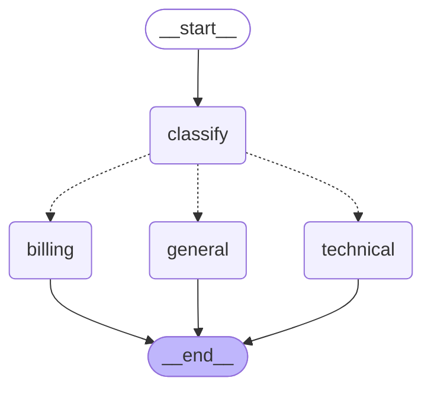

# langgraph-ticket-router

A stateful support-ticket router built with **LangGraph**: it classifies an
incoming ticket, branches into a category-specific handler based on that
classification, and drafts a resolution — with the full state and execution
trace persisting across every node in the graph.

## Workflow diagram

This is generated directly from the compiled graph object
(`app.get_graph().draw_mermaid()`), not hand-drawn:



## Example run

```
$ python main.py
======================================================================
TICKET:   I was charged $49.99 twice on my last invoice, can you refund the duplicate?
CATEGORY: billing
TRACE:    classified as 'billing' -> drafted response via 'billing' handler
RESPONSE:
[drafted resolution text from Claude]

======================================================================
TICKET:   The app crashes every time I try to export a PDF on version 4.2.1.
CATEGORY: technical
TRACE:    classified as 'technical' -> drafted response via 'technical' handler
RESPONSE:
[drafted resolution text from Claude]
...
```

## Why LangGraph here (vs. the from-scratch agent)

The [function-calling-agent](../function-calling-agent) project implements a
reason-act loop by hand with a plain Python `while` loop. This project uses
LangGraph instead, specifically to get:

- **A typed, shared state object** (`TicketState`) that every node reads
  from and writes to, rather than passing ad hoc arguments between functions.
- **Declarative conditional branching** (`add_conditional_edges`) — the
  routing logic is a graph structure you can visualize and reason about, not
  an `if/elif` chain buried in application code.
- **An accumulating trace** — every node appends to `state["trace"]`, so the
  full path a ticket took through the graph (classify → handler) is
  inspectable after the fact, which matters for debugging and observability
  in a real support pipeline.

## Design notes

- **Nodes take injected functions, not the API client directly.** `classify`
  and each category handler are built by `make_classify_node(classify_fn)` /
  `make_handler_node(category, draft_fn)`. This means `test_graph.py` builds
  the *real* `StateGraph`, compiles it, and runs tickets through it end to
  end — but with fake classify/draft functions standing in for the Anthropic
  calls. The tests verify LangGraph's routing and state behavior, not the
  LLM's output quality.
- **Unknown classifier output can't break routing.** `route_by_category`
  falls back to `"general"` if the category isn't one of the three known
  values — covered by `test_full_graph_never_raises_on_odd_classifier_output`.
- **The classify prompt asks for a single word** and the response is
  normalized (stripped/lowercased) before being checked against the valid
  category set, for the same reason.

## Setup

```bash
pip install -r requirements.txt
cp .env.example .env   # then add your ANTHROPIC_API_KEY
```

## Usage

```bash
python main.py                                   # 3 built-in example tickets
python main.py "Your custom ticket text here"     # single ticket
```

## Tests

```bash
pip install pytest
python -m pytest test_graph.py -v
```

No API key is required to run the tests — they use fake classify/draft
functions to exercise the real graph structure.

## What I'd add next

- Persist `TicketState` to a checkpointer (LangGraph supports this natively)
  so a ticket's progress survives a process restart — useful if a handler
  needs a human-in-the-loop approval step before sending a reply.
- A fourth "escalate" branch for tickets the classifier is unsure about
  (e.g. based on a confidence score) instead of forcing every ticket into
  one of three buckets.
- Swap the single-word classification prompt for structured output (a JSON
  schema via tool-use) to make the category extraction more robust than
  string-parsing a free-text response.

## Project structure

```
langgraph-ticket-router/
├── graph.py         # TicketState schema, nodes, conditional routing, graph builder
├── llm.py           # Anthropic API calls (classify, draft) -- isolated for testability
├── main.py          # CLI entry point, runs tickets through the live graph
├── test_graph.py    # Tests against the real compiled graph, fake LLM functions
├── requirements.txt
├── .env.example
├── .gitignore
└── README.md
```
